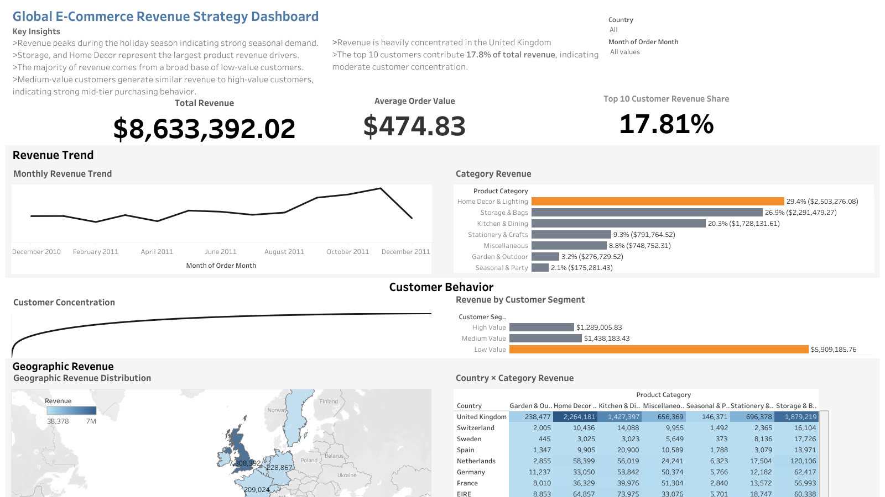

# Customer Retention & Revenue Analysis
SQL + Tableau project analyzing customer retention, revenue concentration, and marketplace performance trends using global retail transaction data.
## Dashboard Preview

## Project Overview
This project analyzes transactional retail data to understand revenue drivers, customer retention behavior, and marketplace performance. The goal of this analysis is to identify which customers, product categories, and geographic markets contribute most to long-term revenue growth.

The analysis simulates a marketplace-style business problem similar to companies like Uber, Airbnb, or e-commerce platforms where understanding customer behavior and revenue concentration is critical for strategic decision making.

## Project Goal

The goal of this project is to simulate the type of marketplace analysis performed by strategy and analytics teams at companies such as Uber, Airbnb, and other platform businesses. The analysis focuses on identifying revenue drivers, customer retention patterns, and market-level performance trends to support data-driven strategic decisions.

---

## Business Problem
Businesses often collect large volumes of transaction data but struggle to identify which customers and behaviors drive sustainable revenue growth.

Key questions addressed in this analysis:

- How concentrated is revenue among customers?
- How valuable are repeat customers compared to one-time buyers?
- Which markets generate the most revenue?
- Which product categories drive the majority of sales?
- Are there seasonal trends in purchasing behavior?

---

## Dataset
The dataset contains global retail transactions including:

- Invoice number
- Customer ID
- Product description
- Quantity
- Unit price
- Transaction date
- Country

This data allows analysis of customer purchasing behavior, revenue distribution, and geographic demand.
## Data Preparation

Before analysis, the dataset was cleaned to remove invalid transactions such as returns or negative quantities. The following steps were applied:

- Removed transactions with negative quantities
- Removed transactions with zero or negative prices
- Filtered rows with missing customer IDs
- Calculated order revenue as `quantity * unit_price`

These steps ensure the analysis reflects valid customer purchases and reliable revenue metrics.

---

## Tools Used
- SQL (data analysis)
- Tableau (data visualization)
- Excel (data preparation)

---

## Analytical Approach

The analysis focuses on several key areas:

**Customer Behavior Analysis**
- Unique customer counts
- Repeat customer identification
- Revenue per customer

**Revenue Analysis**
- Total revenue calculation
- Average order value
- Revenue concentration across customers

**Marketplace Performance**
- Revenue by country
- Revenue by product category
- Monthly revenue trends

---

## Key Insights

### Revenue Concentration
A relatively small share of customers contributes a large percentage of total revenue, highlighting the importance of high-value customer retention.

### Repeat Customer Value
Repeat customers generate a disproportionately large share of total revenue, suggesting that retention strategies may provide greater ROI than acquisition-focused strategies alone.

### Seasonal Demand
Revenue increases significantly during peak holiday periods, indicating strong seasonal demand patterns.

### Category Performance
A limited number of product categories generate the majority of revenue, presenting opportunities for targeted merchandising and promotion strategies.

### Geographic Markets
Revenue is concentrated in a small number of geographic markets, suggesting potential opportunities for expansion in underperforming regions.

---

## Business Recommendations

Based on the analysis, the following strategies could improve business performance:

- Develop targeted retention campaigns for high-value repeat customers
- Align marketing campaigns and inventory planning with seasonal demand peaks
- Focus promotional efforts on top-performing product categories
- Explore growth opportunities in underpenetrated geographic markets

---

## Dashboard

---

## Portfolio

More analytics projects and dashboards can be found at:

[Portfolio Website](https://oliveanageeullah.wixsite.com/olivea-nageeullah)

---

## Author
Olivea Nageeullah  
Data & Strategy Analyst
